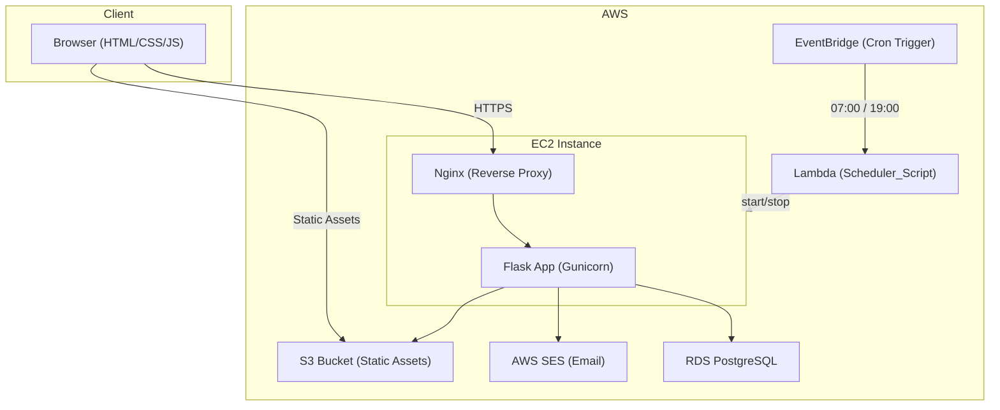
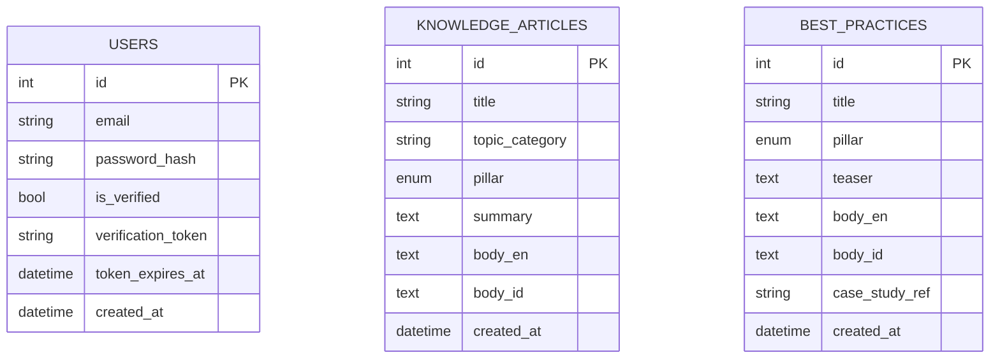

# Design Document: Unified IT Knowledge Portal

## Overview

The Unified IT Knowledge Portal is a full-stack web application built with Python Flask, serving as a bilingual (English/Bahasa Indonesia) knowledge base for SAP Business One and AWS Cloud Infrastructure topics. The portal has two access tiers: a public infographic-style knowledge base for all visitors, and a gated section for advanced best practices requiring email-verified registration.

The system is deployed on AWS EC2 with static assets on S3, a PostgreSQL database on AWS RDS, and includes a standalone FinOps Lambda script for EC2 scheduling.

**Key design decisions:**
- Flask + SQLAlchemy for a lightweight, maintainable Python backend
- Server-side rendering with Jinja2 templates, enhanced with vanilla JavaScript for live search and language toggle (no heavy frontend framework needed)
- JWT-based session tokens stored in HTTP-only cookies for secure session management
- i18n handled via Flask-Babel with JSON translation catalogs
- Debounced AJAX search to meet the 500ms response requirement

---

## Architecture



**Request flow:**
1. Browser sends HTTPS request to Nginx on EC2
2. Nginx proxies to Gunicorn/Flask
3. Flask resolves route, queries RDS via SQLAlchemy, renders Jinja2 template
4. Static assets (CSS, JS, images) are served directly from S3 via CDN-friendly URLs
5. Live search uses AJAX calls to a `/api/search` endpoint returning JSON
6. Email verification uses AWS SES triggered from Flask

---

## Components and Interfaces

### Flask Application Modules

```
app/
├── __init__.py          # App factory, extensions init
├── config.py            # Config classes (Dev, Prod) from env vars
├── models/
│   ├── __init__.py
│   ├── user.py          # User model
│   ├── article.py       # KnowledgeArticle model
│   └── best_practice.py # BestPractice model
├── routes/
│   ├── __init__.py
│   ├── main.py          # Dashboard, pillar pages
│   ├── auth.py          # Register, login, logout, verify
│   └── api.py           # /api/search JSON endpoint
├── services/
│   ├── auth_service.py  # Registration, verification, session logic
│   ├── email_service.py # SES email sending
│   └── search_service.py# Search query logic
├── templates/
│   ├── base.html        # Base layout with nav, footer, language toggle
│   ├── dashboard.html
│   ├── sap/
│   │   └── index.html
│   ├── aws/
│   │   └── index.html
│   ├── best_practices/
│   │   └── index.html
│   └── auth/
│       ├── register.html
│       └── login.html
├── static/
│   ├── css/
│   ├── js/
│   │   ├── search.js    # Debounced live search
│   │   └── i18n.js      # Language toggle
│   └── images/
├── translations/
│   ├── en/messages.json
│   └── id/messages.json
└── scripts/
    ├── seed.py          # Database seeder
    └── scheduler.py     # EC2 FinOps Lambda script
```

### Key Interfaces

**Search API** (`GET /api/search?q=<query>&lang=<en|id>`)
```json
{
  "results": [
    {
      "id": 1,
      "title": "string",
      "pillar": "SAP | AWS",
      "content_type": "knowledge_article | best_practice",
      "teaser": "string | null",
      "is_gated": false
    }
  ],
  "count": 1
}
```

**Auth Routes:**
- `POST /auth/register` — create unverified user, send verification email
- `GET /auth/verify/<token>` — verify email token
- `POST /auth/login` — authenticate, set session cookie
- `POST /auth/logout` — invalidate session

**Language Toggle** (`POST /api/set-language`)
```json
{ "lang": "en" | "id" }
```
Stores preference in server-side session; returns 200 OK.

### EC2 Scheduler Script Interface

The `scheduler.py` Lambda handler reads:
- `EC2_INSTANCE_ID` — environment variable
- `ACTION` — `"start"` or `"stop"` (passed via EventBridge event payload)

---

## Data Models

### User

```python
class User(db.Model):
    __tablename__ = "users"

    id                 = db.Column(db.Integer, primary_key=True)
    email              = db.Column(db.String(255), unique=True, nullable=False)
    password_hash      = db.Column(db.String(255), nullable=False)
    is_verified        = db.Column(db.Boolean, default=False, nullable=False)
    verification_token = db.Column(db.String(255), nullable=True)
    token_expires_at   = db.Column(db.DateTime, nullable=True)
    created_at         = db.Column(db.DateTime, default=datetime.utcnow)
```

### KnowledgeArticle

```python
class KnowledgeArticle(db.Model):
    __tablename__ = "knowledge_articles"

    id             = db.Column(db.Integer, primary_key=True)
    title          = db.Column(db.String(255), nullable=False)
    topic_category = db.Column(db.String(100), nullable=False)  # e.g. "Master Data", "EC2"
    pillar         = db.Column(db.Enum("SAP", "AWS"), nullable=False)
    summary        = db.Column(db.Text, nullable=True)
    body_en        = db.Column(db.Text, nullable=False)
    body_id        = db.Column(db.Text, nullable=True)
    created_at     = db.Column(db.DateTime, default=datetime.utcnow)
```

### BestPractice

```python
class BestPractice(db.Model):
    __tablename__ = "best_practices"

    id              = db.Column(db.Integer, primary_key=True)
    title           = db.Column(db.String(255), nullable=False)
    pillar          = db.Column(db.Enum("SAP", "AWS"), nullable=False)
    teaser          = db.Column(db.Text, nullable=False)
    body_en         = db.Column(db.Text, nullable=False)
    body_id         = db.Column(db.Text, nullable=True)
    case_study_ref  = db.Column(db.String(100), nullable=True)
    created_at      = db.Column(db.DateTime, default=datetime.utcnow)
```

### Database Indexes

```sql
CREATE INDEX idx_articles_pillar ON knowledge_articles(pillar);
CREATE INDEX idx_articles_topic   ON knowledge_articles(topic_category);
CREATE INDEX idx_bp_pillar         ON best_practices(pillar);
CREATE INDEX idx_users_email       ON users(email);

-- Full-text search index for search performance
CREATE INDEX idx_articles_fts ON knowledge_articles
    USING gin(to_tsvector('english', title || ' ' || body_en));
CREATE INDEX idx_bp_fts ON best_practices
    USING gin(to_tsvector('english', title || ' ' || body_en));
```

### Entity Relationship Diagram



---

## Correctness Properties

*A property is a characteristic or behavior that should hold true across all valid executions of a system — essentially, a formal statement about what the system should do. Properties serve as the bridge between human-readable specifications and machine-verifiable correctness guarantees.*

### Property 1: Pillar page renders all articles from database

*For any* set of KnowledgeArticle records belonging to a given pillar (SAP or AWS), rendering that pillar's page should produce HTML containing every article's title exactly once — no more, no fewer.

**Validates: Requirements 1.5, 2.2, 3.2**

---

### Property 2: Best Practice teaser visibility is access-controlled

*For any* BestPractice record, an unauthenticated request to the best practices page should return HTML that contains the item's title and teaser, includes the blur CSS class on the body element, and includes the lock icon markup. An authenticated request for the same record should return HTML that contains the full body content and does NOT contain the blur class or lock icon.

**Validates: Requirements 4.1, 4.2, 4.6**

---

### Property 3: Registration creates an unverified user

*For any* valid (unique email, password of length ≥ 8) pair submitted to the registration endpoint, the Auth_System should create exactly one User record in the database with `is_verified = False` and the submitted email address.

**Validates: Requirements 5.1**

---

### Property 4: Email verification token validity gate

*For any* User with a valid (unexpired, unused) verification token, calling the verify endpoint with that token should set `is_verified = True`. *For any* User with an expired token (older than 24 hours), calling the verify endpoint should leave `is_verified = False` and return an error response.

**Validates: Requirements 5.3, 5.7**

---

### Property 5: Verification status gates login

*For any* unverified User, submitting correct credentials to the login endpoint should be denied (no session created). *For any* verified User, submitting correct credentials should succeed and create an authenticated session.

**Validates: Requirements 5.4, 6.1**

---

### Property 6: Duplicate registration is rejected

*For any* email address already present in the users table, submitting a new registration with that same email should return an error response and not create a second User record.

**Validates: Requirements 5.5**

---

### Property 7: Password length validation

*For any* password string of length less than 8 characters, the registration endpoint should return a validation error and not create a User record. *For any* password string of length 8 or more characters (paired with a valid unique email), registration should succeed.

**Validates: Requirements 5.6**

---

### Property 8: Login error message is non-discriminating

*For any* combination of (existing email + wrong password) and (non-existent email + any password), the error message returned by the login endpoint should be identical — it must not reveal whether the email exists.

**Validates: Requirements 6.2**

---

### Property 9: Logout invalidates session

*For any* active authenticated session, after calling the logout endpoint, subsequent requests using that session token to access gated content should be treated as unauthenticated (redirect or 401 response).

**Validates: Requirements 6.3**

---

### Property 10: Session expiry enforced

*For any* session whose last-activity timestamp is more than 60 minutes in the past, requests using that session token should be rejected as unauthenticated.

**Validates: Requirements 6.5**

---

### Property 11: Search results are complete and correctly formatted

*For any* search query of 2 or more characters against a known dataset, every KnowledgeArticle and BestPractice whose title or body contains the query string should appear in the results. Each result object must contain `title`, `pillar`, and `content_type` fields. For unauthenticated requests, BestPractice results must not expose `body_en` or `body_id` — only `title` and `teaser`.

**Validates: Requirements 7.2, 7.3, 7.4**

---

### Property 12: Language rendering with fallback

*For any* KnowledgeArticle or BestPractice with both `body_en` and `body_id` populated, rendering the detail page with language set to `id` should display `body_id`. Rendering with language set to `en` should display `body_en`. *For any* article where `body_id` is null, rendering with language set to `id` should fall back to displaying `body_en`.

**Validates: Requirements 8.5, 8.6**

---

### Property 13: Seeder is idempotent

*For any* database state, running the seeder script twice should produce the same record counts as running it once — no duplicate entries should be created on the second run.

**Validates: Requirements 9.7**

---

### Property 14: Scheduler is idempotent

*For any* EC2 instance already in the target state (running when `start` is called, or stopped when `stop` is called), the scheduler script should not invoke the AWS start/stop API and should log the current state.

**Validates: Requirements 11.5**

---

### Property 15: Scheduler logs contain required fields

*For any* start or stop action executed by the scheduler script, the log output should contain the action name, the EC2 instance ID, and a timestamp.

**Validates: Requirements 11.6**

---

## Error Handling

### Authentication Errors

| Scenario | HTTP Status | Response |
|---|---|---|
| Invalid credentials | 401 | Generic "Invalid email or password" message |
| Unverified account login | 403 | "Please verify your email before logging in" |
| Expired verification token | 400 | "Verification link has expired. Request a new one." |
| Duplicate email registration | 409 | "An account with this email already exists." |
| Password too short | 422 | "Password must be at least 8 characters." |
| Session expired / invalid | 401 | Redirect to login page |

### Content Errors

| Scenario | Behavior |
|---|---|
| No articles in pillar | Display placeholder "No content available yet." |
| Missing translation (body_id is null) | Fall back to body_en silently |
| Article not found (direct URL) | 404 page |

### Search Errors

| Scenario | Behavior |
|---|---|
| Query < 2 characters | No request sent (client-side guard) |
| No results | Display "No results found for your search." |
| Search service error | Display "Search is temporarily unavailable." with 500 logged |

### EC2 Scheduler Errors

| Scenario | Behavior |
|---|---|
| Missing `EC2_INSTANCE_ID` env var | Raise `ValueError`, log error, exit with non-zero code |
| Boto3 API error | Catch `ClientError`, log full error details, re-raise |
| Instance already in target state | Log current state, return without API call |

### General Flask Error Handlers

```python
@app.errorhandler(404)
def not_found(e): ...

@app.errorhandler(500)
def server_error(e): ...
```

All unhandled exceptions are logged with stack traces via Python's `logging` module. No raw exception details are exposed to the client.

---

## Testing Strategy

### Dual Testing Approach

Unit tests cover specific examples, edge cases, and error conditions. Property-based tests verify universal properties across many generated inputs. Both are complementary.

### Property-Based Testing Library

**pytest-hypothesis** (Python) is used for all property-based tests.

- Minimum **100 iterations** per property test (Hypothesis default is 100; set `@settings(max_examples=100)`)
- Each property test is tagged with a comment referencing the design property:
  - Tag format: `# Feature: unified-it-knowledge-portal, Property {N}: {property_text}`

### Unit Tests

Focus areas:
- Auth service: registration validation, token generation, password hashing
- Search service: query building, result formatting, access-control filtering
- Language service: fallback logic, session persistence
- Seeder: idempotency check with pre-seeded database
- Scheduler: boto3 mock-based tests for start/stop/no-op logic

### Property Tests (pytest-hypothesis)

Each correctness property maps to one property-based test:

| Property | Test Description | Hypothesis Strategy |
|---|---|---|
| P1 | Pillar page renders all articles | `st.lists(article_strategy())` |
| P2 | Best practice access control | `st.builds(BestPractice, ...)` |
| P3 | Registration creates unverified user | `st.emails(), st.text(min_size=8)` |
| P4 | Token validity gate | `st.datetimes()` for expiry |
| P5 | Verification gates login | `st.booleans()` for is_verified |
| P6 | Duplicate registration rejected | `st.emails()` |
| P7 | Password length validation | `st.text(min_size=0, max_size=20)` |
| P8 | Non-discriminating error message | `st.emails(), st.text()` |
| P9 | Logout invalidates session | Session token strategy |
| P10 | Session expiry enforced | `st.integers(min_value=61)` for minutes |
| P11 | Search completeness and format | `st.lists(article_strategy()), st.text(min_size=2)` |
| P12 | Language rendering with fallback | `st.one_of(st.text(), st.none())` for body_id |
| P13 | Seeder idempotency | Run seeder twice, compare counts |
| P14 | Scheduler idempotency | Mock boto3, vary instance state |
| P15 | Scheduler log fields | Mock boto3, capture log output |

### Integration Tests

- End-to-end registration → email verification → login → access gated content flow
- Search endpoint with real database queries (SQLite in-memory for CI)
- Seeder execution against a test database

### Test Configuration

```python
# conftest.py
@pytest.fixture
def app():
    app = create_app({"TESTING": True, "SQLALCHEMY_DATABASE_URI": "sqlite:///:memory:"})
    with app.app_context():
        db.create_all()
        yield app
        db.drop_all()
```

All tests run against an in-memory SQLite database to avoid RDS dependency in CI. The scheduler tests mock boto3 entirely.
